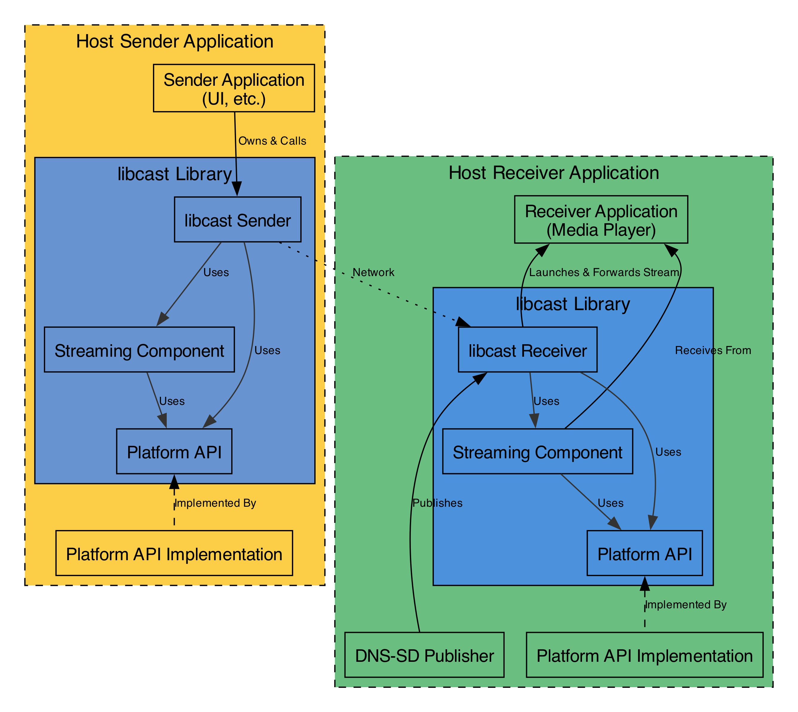

# libcast High-Level Architecture

## Introduction

The `libcast` library implements the core Cast protocols, enabling discovery,
application control, and real-time media streaming between sender and receiver
devices. The library is designed to be modular and portable, relying on a
platform abstraction layer for easy integration into various applications and
operating systems.

[TOC]

## `libcast` vs. Host Application Responsibilities

One of the more complex elements of working with libcast is the division of
responsibilities between libcast and the hosting application. While the host
application is the consumer of libcast, taking outputted frames and rendering
media in its own user interface, it also plays the role of provider, being
responsible for implementing the platform API so that libcast can access lower
level functionality, such as logs, the network stack, and tracing features.

- **Host Application:** This is the code you write. It includes the main
  business logic of your application (e.g., the UI of a receiver app) and the
  code that handles media playback (e.g., an SDL-based video player on a
  receiver). Crucially, it provides the concrete _implementations_ for the
  Platform API (like networking) and is responsible for publishing the receiver
  to the network.

- **`libcast` Library:** This is the core Open Screen component. It manages the
  CastV2 protocol, session negotiation, and streaming transport. It defines the
  _interfaces_ for the Platform API that the host application must implement.

## Core Components

The libcast library is primarily composed of four major components: the Sender,
the Receiver, the Streaming component. Note that libcast take some dependencies
on other areas of Open Screen, such as the [Platform](../../platform/README.md)
API, utilities in the `util/` folder, etc.

### Sender Component

The Sender is the client component that initiates communication. Its primary
roles are:

- **Session Management:** Establishing a secure connection to a receiver,
  launching applications, and managing the application lifecycle.

- **Media Control:** `libcast` does not directly implement media playback
  control. Support for controlling playback during remoting sessions is handled
  by the application sending messages from the
  [remoting.proto](../streaming/remoting.proto) Protobuf schema. Playback
  control of streaming sessions is not currently defined, and play, pause, and
  seek messages are ignored. Client applications desiring to send custom media
  control messages can implement this using `libcast`'s
  [`CastSocket`](../common/public/cast_socket.h) API.

### Receiver Component

The `libcast` Receiver is the server component running on a Cast device. It is
not responsible for media playback or network discovery, but rather for managing
the Cast session and the lifecycle of the Receiver Application. Its primary
roles are:

- **Connection Handling:** Accepting connections from senders and managing the
  secure CastV2 channel.

- **Application Management:** Launching and terminating the Receiver Application
  based on requests from the sender. It acts as a bridge between the sender and
  the Receiver Application.

*** note
One of the more confusing things about the layout of the `cast/`
folder is that the `receiver/` and `sender/` subfolders do not actually contain
the Cast `Receiver` and `Sender` classes, since these classes are actually part
of the `streaming/` component.

The receiver component actually contains a pretty small subset of the castv2
logic, most notably the [`ApplicationAgent`](../receiver/application_agent.h)
and some channel code.
***

### Streaming Component

The Streaming component manages the real-time transport of media. It is used by
both the Sender (for packetizing and sending) and the Receiver (for receiving
and reconstructing the media stream).

- **Session Negotiation:** Implements the offer/answer protocol (similar to
  WebRTC) to negotiate media formats, codecs, and network parameters.

- **Media Transport:** Manages the RTP/RTCP sessions for efficient and
  synchronized delivery of audio and video frames.

- **Encoding/Decoding Negotiation:** Provides the framework for negotiating
  hardware or software codecs, but does not implement the codecs themselves.

*** aside
For more information, see the streaming [README.md](../streaming/README.md).
***

## Extended Topics

### Libcast and Its Use of The Platform API

The Platform API is a crucial abstraction layer that decouples the core
`libcast` logic from any specific operating system or hardware. It defines a set
of interfaces that the embedding application must implement.

- **Responsibilities:** Provides platform-specific implementations for
  networking (sockets, mDNS), threading (clocks, tasks), and logging.

- **Portability:** By requiring the host application to provide these
  implementations, `libcast` remains highly portable across different
  environments, from embedded devices to desktop applications.

### Hosting the Library

The `libcast` Sender and Receiver are library components, not standalone
executables. A developer must write a host application that integrates and
"hosts" the library. This host application is what gets compiled into the final
`sender` or `receiver` binary. The host application's primary responsibilities
from libcast's perspective are:

1. **Platform Initialization:** Setting up the platform-specific implementations
   (networking, threading, etc.) required by the Platform API. In the Open
   Screen codebase, this is handled by creating an `Environment`.

2. **Component Instantiation:** Creating an instance of the `libcast` Sender or
   Receiver component.

3. **Execution:** Starting the component and running the main event loop (or
   task runner) that drives all asynchronous operations.

4. **Service Publication (for Receivers):** For a receiver to be discoverable,
   the host application must publish its network presence. This involves
   creating a `ReceiverInfo` record with the device's details (e.g., friendly
   name, port), converting it to a `DnsSdInstance`, and registering it with the
   DNS-SD service. The `standalone_receiver/cast_service.cc` file is the
   reference example of this application flow.

5. **Discovery (for Senders)** Finding Cast-enabled receivers on the local
   network using mDNS/DNS-SD. Libcast does not directly depend on discovery, and
   the host application is responsible for implementing it, potentially by using
   Open Screen's [discovery/](../../discovery/README.md) implementation. The
   standalone sender and receiver both integrate this discovery functionality.

For a receiver, the host application instantiates the `libcast` Receiver, which
then listens for connections. When a LAUNCH request arrives, the `libcast`
Receiver then launches the separate Receiver Application logic.

The `standalone_sender/main.cc` and `standalone_receiver/main.cc` files are
reference examples of how to write such a host application.
